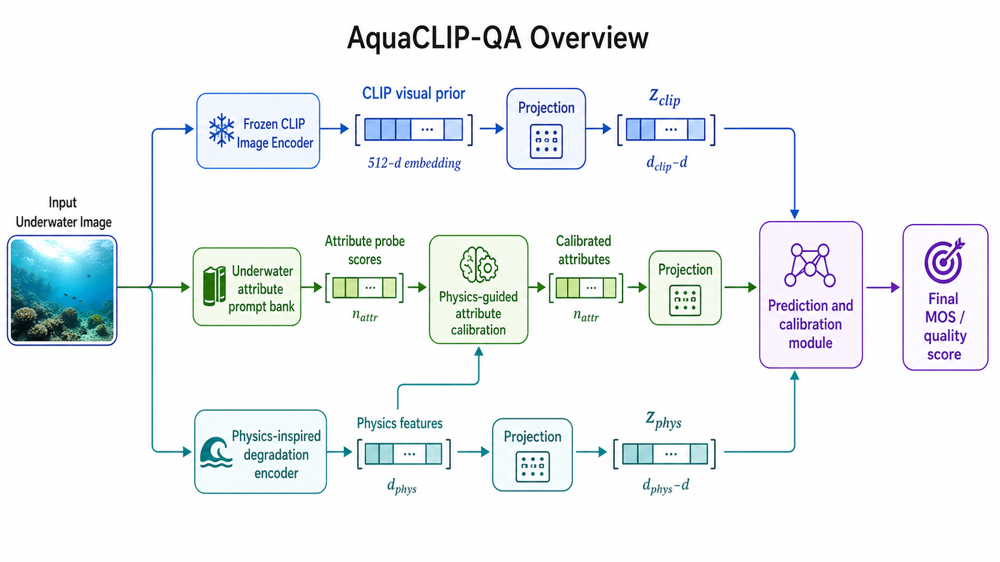
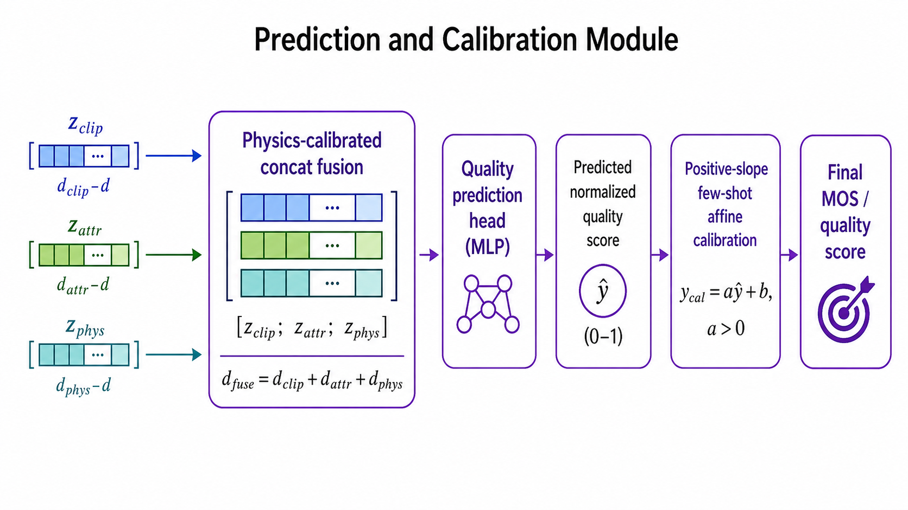
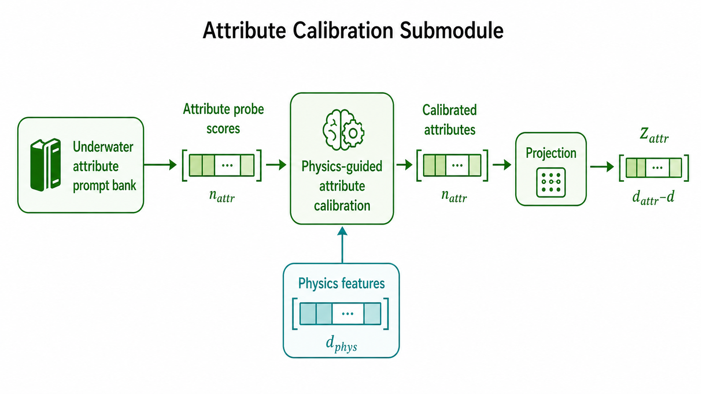

# AquaCLIP-QA

AquaCLIP-QA 是一个无参考水下图像质量评价模型，用于预测归一化 MOS 质量分数。模型融合 CLIP 图像表征、水下属性提示分数和物理退化特征；最终预测路径采用 concat fusion，reliability 分支用于解释分析。

当前最终实验协议：

- 训练库：`LUIQD + UIQD + UWIQA`
- 测试库：`UID2021 + SAUD2 + SOTA + UIED`
- 目标测试库完全不参与训练
- 指标：`SRCC / PLCC / NRMSE`
- `PLCC` 和 `NRMSE` 使用线性映射到 normalized MOS 后计算

## 模型结构

### 总体结构



### 预测模块



### 解释分支



## 目录结构

```text
aquaclip/
  model.py                  # 模型结构
  data.py                   # 特征读取与归一化
  train.py                  # 训练与评估入口
  calibration.py            # positive-slope affine calibration
  configs/                  # 配置文件
  docs/                     # 文档和结构图
  reports/                  # 汇总结果表
  outputs/                  # 训练输出、模型权重和预测结果
```

## 最终结果

下表每个单元格为 `SRCC / PLCC / NRMSE`。其中 AquaCLIP-QA 使用端到端图像输入计时版本，避免只统计缓存特征前向。

| Dataset | AquaCLIP-QA | LIQE | MUSIQ | TOPIQ-NR | HyperIQA | DBCNN | CLIP-IQA | ATUIQP | UCIQE | PaQ-2-PiQ | NIQE | UIQM | TReS |
|---|---:|---:|---:|---:|---:|---:|---:|---:|---:|---:|---:|---:|---:|
| UID2021 | **0.586 / 0.603 / 0.190** | 0.489 / 0.503 / 0.206 | 0.411 / 0.389 / 0.220 | 0.335 / 0.333 / 0.225 | 0.317 / 0.317 / 0.226 | 0.380 / 0.380 / 0.221 | 0.236 / 0.245 / 0.231 | 0.456 / 0.486 / 0.209 | 0.503 / 0.543 / 0.200 | 0.343 / 0.315 / 0.227 | 0.166 / 0.138 / 0.236 | 0.351 / 0.218 / 0.233 | 0.290 / 0.264 / 0.230 |
| SAUD2 | **0.231 / 0.248 / 0.227** | 0.192 / 0.206 / 0.229 | 0.132 / 0.128 / 0.232 | 0.127 / 0.137 / 0.232 | 0.123 / 0.126 / 0.232 | 0.065 / 0.076 / 0.234 | 0.142 / 0.144 / 0.232 | 0.109 / 0.093 / 0.233 | -0.051 / 0.001 / 0.234 | 0.089 / 0.106 / 0.233 | 0.010 / 0.066 / 0.234 | -0.069 / 0.209 / 0.229 | 0.128 / 0.134 / 0.232 |
| SOTA | **0.456 / 0.480 / 0.184** | 0.277 / 0.275 / 0.202 | 0.221 / 0.212 / 0.205 | 0.188 / 0.182 / 0.206 | 0.198 / 0.191 / 0.206 | 0.130 / 0.105 / 0.209 | 0.126 / 0.133 / 0.208 | -0.001 / 0.002 / 0.210 | 0.016 / 0.008 / 0.210 | 0.068 / 0.053 / 0.210 | 0.097 / 0.084 / 0.209 | 0.116 / 0.077 / 0.209 | -- |
| UIED | **0.495 / 0.509 / 0.188** | 0.348 / 0.354 / 0.204 | 0.309 / 0.285 / 0.210 | 0.306 / 0.302 / 0.208 | 0.285 / 0.284 / 0.210 | 0.198 / 0.186 / 0.215 | 0.251 / 0.245 / 0.212 | 0.107 / 0.150 / 0.216 | 0.199 / 0.211 / 0.214 | 0.167 / 0.096 / 0.218 | 0.254 / 0.221 / 0.213 | -0.071 / 0.096 / 0.218 | -- |
| Mean | **0.442 / 0.460 / 0.197** | 0.327 / 0.334 / 0.210 | 0.268 / 0.253 / 0.217 | 0.239 / 0.238 / 0.218 | 0.231 / 0.229 / 0.219 | 0.193 / 0.187 / 0.219 | 0.189 / 0.192 / 0.221 | 0.168 / 0.182 / 0.217 | 0.167 / 0.191 / 0.215 | 0.167 / 0.143 / 0.222 | 0.132 / 0.127 / 0.223 | 0.082 / 0.150 / 0.222 | 0.209 / 0.199 / 0.231 |

## 快速运行

在仓库根目录运行：

```powershell
python aquaclip\train.py `
  --train uid2021:v0\outputs\uid2021_clip_scores.csv:v0\outputs\uid2021_physics.csv `
  --output-dir aquaclip\outputs\uid2021 `
  --experiment-name aquaclip_final_uid2021 `
  --variant aquaclip-final `
  --device auto
```

常用模型变体：

```text
aquaclip-final
concat
full
regression-only
hybrid-fusion
```